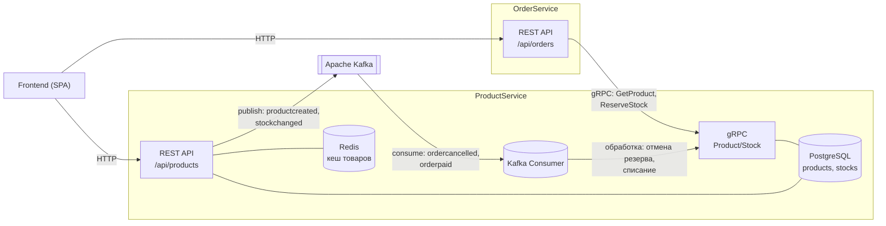
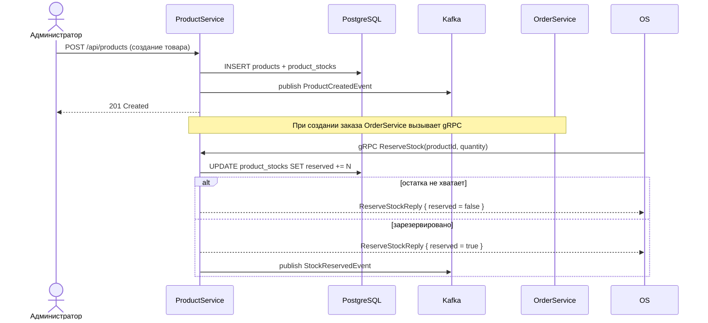
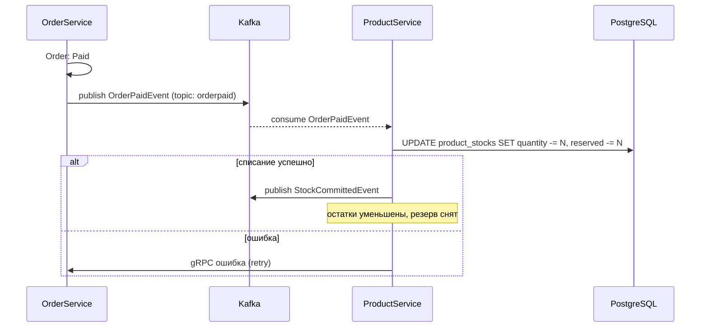
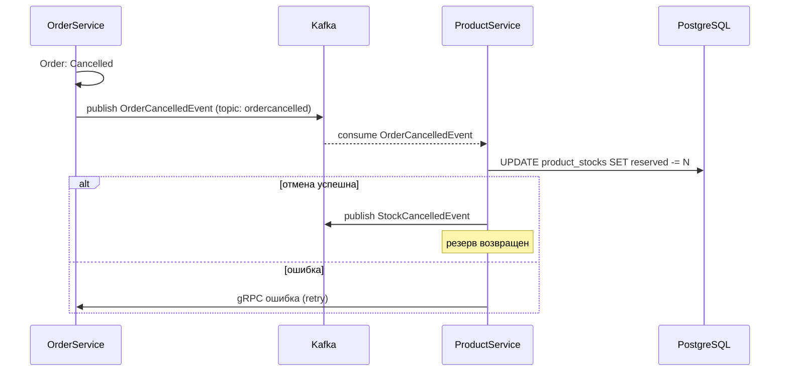

# ProductService — Система управления товарами (Маркетплейс)

Микросервис системы управления товарами учебного проекта «Маркетплейс». Отвечает за управление каталогом товаров, остатками на складах и резервирование товаров при оформлении заказов. Является частью микросервисной архитектуры и взаимодействует с системой заказов (**OrderService**) синхронно через gRPC и асинхронно через Kafka. С фронтендом сервис общается по HTTP (REST).

## Технологический стек

| Категория            | Технология                                   |
|----------------------|----------------------------------------------|
| Платформа            | .NET 9 / ASP.NET Core     |
| База данных          | PostgreSQL                                   |
| Доступ к данным      | Dapper (чистый SQL, без ORM)                 |
| Миграции             | FluentMigrator                               |
| Валидация            | FluentValidation                             |
| Межсервисный sync    | gRPC (Grpc.AspNetCore)                       |
| Кеширование          | Redis + in-memory (двухуровневый кеш)        |
| Брокер сообщений     | Apache Kafka (Confluent.Kafka)               |
| Маппинг              | AutoMapper                                   |
| Тесты                | NUnit, Moq, FluentAssertions                 |
| Контейнеризация      | Docker, docker-compose                       |

## Архитектура (Clean Architecture, 4 слоя)

```
Domain          // Сущности, value objects, интерфейсы репозиториев
Application     // Use cases, DTO, абстракции, события, валидаторы, маппинг
Infrastructure  // Dapper-репозитории, миграции, Redis, Kafka, gRPC-сервисы
Presentation    // REST-контроллеры, gRPC-сервисы, обработка ошибок, DI, точка входа
Tests           // Unit + интеграционные тесты
```

Зависимости направлены внутрь: `Presentation → Infrastructure → Application → Domain`,
где Infrastructure зависит от Application и Domain, Application зависит от Domain.
Внешние зависимости описаны абстракциями в `Application/Ports`:
- **Входные порты** (`Application/Ports/Input`): `IProductService`, `IStockService` — интерфейсы, реализуемые Application слоем.
- **Выходные порты** (`Application/Ports/Output`): `IMessageBus`, `IProductCache` — интерфейсы, реализуемые Infrastructure слоем.
- **Интерфейсы репозиториев** (`Domain/Interfaces`): `IProductRepository`, `IStockRepository` — реализуются Infrastructure слоем.

### Сценарии работы

Сервис предоставляет три группы сценариев:

#### 1. Управление товарами (ProductService)
- `IProductService` — CRUD операции с товарами (создание, обновление, удаление, получение).
- Поиск и фильтрация товаров с пагинацией (по названию, категории, цене, наличию).
- Получение списка категорий.

#### 2. Управление остатками (StockService)
- `IStockService` — управление остатками товаров на складах.
- Резервирование товара при оформлении заказа.
- Подтверждение резерва (списание) после оплаты заказа.
- Отмена резерва при отмене заказа.

#### 3. Интеграция с OrderService
- gRPC сервисы: `ProductGrpcService`, `StockGrpcService` для синхронных вызовов.
- Kafka консьюмеры: `OrderCancelledEventHandler` для асинхронной обработки отмен заказов.
- Kafka продюсеры: публикация событий о создании/обновлении/удалении товаров, изменении остатков.

## Бизнес-логика (Domain Layer)

### Сущность Product
- Управление товаром: название, описание, цена, SKU (артикул), категория.
- Soft-delete: продукт помечается как удаленный, но сохраняется в БД.
- Валидация: название не пустое и не длиннее 200 символов, цена положительная, SKU соответствует формату `^[A-Z0-9\-]+$`.

### Value Objects
- **Money** — денежная сумма с валютой (поддерживает сложение, вычитание, сравнение).
- **Sku** — артикул товара (валидация формата).

### Сущность ProductStock
- Управление остатками: общее количество, зарезервированное количество, склад, срок доставки.
- Расчет доступного количества: `Available = Quantity - Reserved`.
- Операции: резервирование (`TryReserve`), подтверждение резерва (`CommitReservation`), отмена резерва (`CancelReservation`), пополнение/списание остатков.

## REST API

### Товары (Products)

| Метод | Маршрут                              | Описание                                |
|-------|--------------------------------------|-----------------------------------------|
| GET   | `/api/products`                      | Список товаров (фильтр, пагинация, сортировка) |
| GET   | `/api/products/{id}`                 | Товар по id (с кешем)                   |
| GET   | `/api/products/{id}/stock`           | Остатки товара                          |
| GET   | `/api/products/categories`           | Список всех категорий (с кешем)         |
| POST  | `/api/products`                      | Создать товар (админский)               |
| PUT   | `/api/products/{id}`                 | Обновить товар (админский)              |
| DELETE| `/api/products/{id}`                 | Удалить товар (soft delete)             |
| POST  | `/api/products/batch`                | Получить несколько товаров по id (для OrderService) |
| POST  | `/api/products/{id}/reserve`         | Зарезервировать товар (для OrderService)|
| POST  | `/api/products/{id}/add-stock`       | Добавить остатки (админский)            |

### Параметры фильтрации

| Параметр         | Тип    | Описание                           |
|------------------|--------|------------------------------------|
| `search`         | string | Поиск по названию товара           |
| `category`       | string | Фильтр по категории                |
| `minPrice`       | decimal| Минимальная цена                   |
| `maxPrice`       | decimal| Максимальная цена                  |
| `inStockOnly`    | bool   | Только товары в наличии            |
| `page`           | int    | Номер страницы (по умолчанию 1)    |
| `pageSize`       | int    | Размер страницы (по умолчанию 20)  |
| `sortBy`         | string | Поле для сортировки (name, price, createdAt, updatedAt) |
| `sortDescending` | bool   | Сортировка по убыванию             |

## gRPC API

Сервис предоставляет gRPC API для синхронного взаимодействия с OrderService.

### product.proto

```protobuf
syntax = "proto3";

option csharp_namespace = "ProductServiceGrpc.Grpc";

package product;

service ProductServiceGrpc {
  rpc GetProduct (GetProductRequest) returns (ProductResponse);
  rpc GetProducts (GetProductsRequest) returns (GetProductsResponse);
  rpc GetProductsBatch (GetProductsBatchRequest) returns (GetProductsBatchResponse);
}
```

### stock.proto

```protobuf
syntax = "proto3";

option csharp_namespace = "ProductServiceGrpc.Grpc";

package stock;

service StockServiceGrpc {
  rpc GetStock (GetStockRequest) returns (StockResponse);
  rpc ReserveStock (ReserveStockRequest) returns (ReserveStockResponse);
  rpc CommitReservation (CommitReservationRequest) returns (CommitReservationResponse);
  rpc CancelReservation (CancelReservationRequest) returns (CancelReservationResponse);
}
```

## Интеграция с OrderService

### Синхронно (gRPC, входящие вызовы)

OrderService вызывает gRPC методы для:
- `GetProduct` — получение информации о товаре (цена, наличие).
- `GetProductsBatch` — массовое получение информации о товарах.
- `ReserveStock` — резервирование товара при создании заказа.
- `CommitReservation` — подтверждение резерва (списание) после оплаты.
- `CancelReservation` — отмена резерва при отмене заказа.

> gRPC работает поверх HTTP/2. ProductService слушает порт в режиме `Http1AndHttp2`
> (REST для фронта + gRPC для OrderService).

### Асинхронно (Kafka, консьюмеры)

ProductService слушает события от OrderService:

| Топик               | Событие                       | Действие                            |
|---------------------|-------------------------------|-------------------------------------|
| `ordercancelled`    | `OrderCancelledEvent`         | Отмена резерва товара               |
| `orderpaid`         | `OrderPaidEvent`              | Подтверждение резерва (списание)    |

### Асинхронно (Kafka, продюсеры)

ProductService публикует события:

| Топик               | Событие                       | Описание                            |
|---------------------|-------------------------------|-------------------------------------|
| `productcreated`    | `ProductCreatedEvent`         | Создан новый товар                  |
| `productupdated`    | `ProductUpdatedEvent`         | Обновлен товар                      |
| `productdeleted`    | `ProductDeletedEvent`         | Удален товар                        |
| `stockchanged`      | `StockChangedEvent`           | Изменены остатки                    |
| `stockreserved`     | `StockReservedEvent`          | Зарезервирован товар                |
| `stockcommitted`    | `StockCommittedEvent`         | Подтвержден резерв                  |

## Диаграммы взаимодействия микросервисов

### Общая схема (контекст)



### Сценарий 1. Создание и резервирование товара



### Сценарий 2. Оплата заказа (списание резерва)



### Сценарий 3. Отмена заказа (возврат резерва)



## Схема БД

### Таблица products (товары)
```sql
CREATE TABLE products (
    id UUID PRIMARY KEY,
    name VARCHAR(200) NOT NULL,
    description TEXT,
    price DECIMAL(12,2) NOT NULL,
    currency VARCHAR(3) NOT NULL DEFAULT 'USD',
    sku VARCHAR(50) NOT NULL UNIQUE,
    category VARCHAR(100) NOT NULL,
    is_deleted BOOLEAN DEFAULT FALSE,
    created_at TIMESTAMP DEFAULT NOW(),
    updated_at TIMESTAMP
);
```

### Таблица product_stocks (остатки)
```sql
CREATE TABLE product_stocks (
    id UUID PRIMARY KEY,
    product_id UUID NOT NULL REFERENCES products(id),
    quantity INT NOT NULL DEFAULT 0,
    reserved INT NOT NULL DEFAULT 0,
    warehouse VARCHAR(100) NOT NULL DEFAULT 'main',
    lead_time_days INT NOT NULL DEFAULT 3,
    created_at TIMESTAMP DEFAULT NOW(),
    updated_at TIMESTAMP,
    CONSTRAINT ck_quantity_nonnegative CHECK (quantity >= 0),
    CONSTRAINT ck_reserved_nonnegative CHECK (reserved >= 0),
    CONSTRAINT ck_reserved_quantity CHECK (reserved <= quantity)
);
```

## Кеширование

Реализован двухуровневый кеш:

1. **L1 (In-Memory)**: кеш в памяти приложения с TTL = 1 минута.
2. **L2 (Redis)**: распределенный кеш с TTL = 10 минут.

Кешируются:
- Товар по ID (`GetByIdAsync`)
- Список категорий (`GetCategoriesAsync`)

Инвалидация кеша происходит при обновлении или удалении товара.

## Тестирование

### Запуск тестов

```bash
# Все тесты
dotnet test
```

### Покрытие кода

Сбор покрытия выполняется через `coverlet.collector`:

```bash
dotnet test --collect:"XPlat Code Coverage" --results-directory ./coverage
```

Для генерации HTML-отчета используйте ReportGenerator:

```bash
dotnet tool install -g dotnet-reportgenerator-globaltool
reportgenerator -reports:./coverage/**/coverage.cobertura.xml \
  -targetdir:./coverage/report -reporttypes:Html
```

Текущее покрытие:
- **Application Layer**: ~92% строк (сервисы, валидаторы, маппинг)
- **Infrastructure Layer**: ~80% строк (репозитории, кеш, Kafka) — покрывается интеграционными тестами
## Запуск

### Через Docker Compose

```bash
docker compose up --build
```

Поднимаются: PostgreSQL, Redis, Zookeeper, Kafka и сам сервис.
API доступно на `http://localhost:5000` (Swagger в режиме Development).
Миграции применяются автоматически при старте приложения.

### Локально

```bash
# Поднять инфраструктуру (postgres/redis/kafka), затем:
dotnet run --project ProductService.Presentation
```

Конфигурация — в `appsettings.json` / `appsettings.Development.json`:
- Строки подключения PostgreSQL и Redis
- Настройки Kafka (bootstrap servers, group id)
- Настройки CORS

## Переменные окружения

| Переменная                           | Описание                           | Значение по умолчанию |
|--------------------------------------|------------------------------------|-----------------------|
| `ConnectionStrings__PostgreSQL`      | Строка подключения к PostgreSQL    | `Host=localhost;Port=5432;Database=ProductServiceDb;Username=postgres;Password=postgres` |
| `Redis__ConnectionString`            | Строка подключения к Redis         | `localhost:6379` |
| `Kafka__BootstrapServers`            | Адрес Kafka брокера                | `localhost:9092` |
| `Kafka__ClientId`                    | ID клиента Kafka                   | `product-service` |
| `Kafka__GroupId`                     | Группа потребителей Kafka          | `product-service-group` |
| `ASPNETCORE_ENVIRONMENT`             | Окружение (Development/Production) | `Development` |

## Обработка ошибок

Все ошибки перехватываются `ErrorHandlingMiddleware` и возвращаются единым JSON-форматом:

```json
{
  "statusCode": 404,
  "message": "Product with id '...' was not found",
  "path": "/api/products/...",
  "timestamp": "2024-01-15T10:30:00Z"
}
```

Типы ошибок:
- `NotFoundException` → 404
- `ValidationException` → 400 (с деталями валидации)
- `BusinessRuleException` → 409
- `DomainException` → 422
- `FluentValidation.ValidationException` → 400 (с деталями валидации)

## Масштабирование

Сервис спроектирован для горизонтального масштабирования:
- **Stateless**: все состояние хранится в PostgreSQL и Redis.
- **Redis**: общий кеш для всех экземпляров.
- **Kafka**: группа потребителей автоматически балансирует нагрузку.
